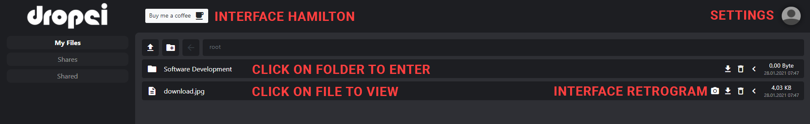

## Documentation and Tutorial for the Cloud Filesystem DROPSI

###### Mathias Schöttle

###Deployment
    1. Kill old process
    2. Delete the old jar
    3. Copy the new jar to directory
    4. execute start.sh (contains program variables)

This account is pre-filled with files and folders

    username: Albus Dumbledore
    password: lemondrops

[Swagger documentation available here](http://im-codd.oth-regensburg.de:8922/swagger-ui)  
*Create Account and login first in different browser tab, otherwise default swagger documentation is shown*

### External Systems
**Pay me a coffee** - *Opens new Tab to Hamilton Bank, Insert Credentials and confirm the payment. Resets at every new session.*  
***Please connect to dropsi with http://im-codd:8922, not http://im-codd.oth-regensburg.de:8922***  
***Otherwise logging in to the bank will end the session in dropsi***

**Post Image to Retrogram** - Add a Retrogram token to your account via the settings page and click on the camera icon next to an image file.  
If the retrogram service is not available, an error message is shown. (*icon is not shown if no token is added to account*)

### Design Decisions
> **Q:** **Why use DTOs for the Files and Folders in the REST API instead of the already existing Entities?**  
> **A:** The Entities used internally have attributes that should not be exposed to the users and systems using the API
> i.e. permissions or accesslogs.  
> Ignoring them via **@JsonIgnore** is not an option as these objects will be parsed back on the consumer side resulting in fields containing null (bad for usability imo)

###### Updated "*Meilenstein 1*" document was added to this directory

---

